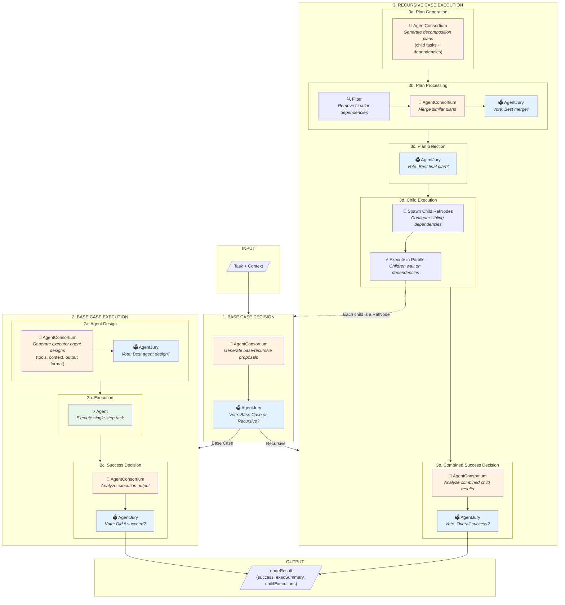

# RAF Complete Algorithm Flow

This diagram shows all steps and agent clusters in the Recursive Agent Framework.

## Complete Flow Diagram

## Agent Cluster Summary

| Step | Cluster Type | Purpose |
|------|-------------|---------|
| 1 | Consortium → Jury | Decide base case vs recursive |
| 2a | Consortium → Jury | Design executor agent |
| 2b | Agent | Execute task |
| 2c | Consortium → Jury | **Vote on success** (separate step) |
| 3a | Consortium | Generate decomposition plans |
| 3b | Consortium → Jury | Merge and select best plan merge |
| 3c | Jury | Select final plan |
| 3d | RafNodes | Spawn and execute children |
| 3e | Consortium → Jury | **Vote on combined success** |

## Legend

- 🔷 **AgentConsortium** (orange) — Multiple agents generating diverse proposals
- 🗳️ **AgentJury** (blue) — Multiple agents voting on best option  
- ⚡ **Agent/Execution** (green) — Single agent or parallel execution
- 🔍 **Filter** — Deterministic processing (no LLM)

## Key Design Decision: Separate Success Vote

The success determination is explicitly separated from execution:

1. **Executor runs** → produces raw output
2. **Success Consortium** → analyzes output, generates success assessments
3. **Success Jury** → votes on whether execution succeeded

This separation allows:
- Executor to focus purely on task completion
- Success criteria to be evaluated by fresh context
- Multiple perspectives on what constitutes success
- Clear audit trail of success reasoning
