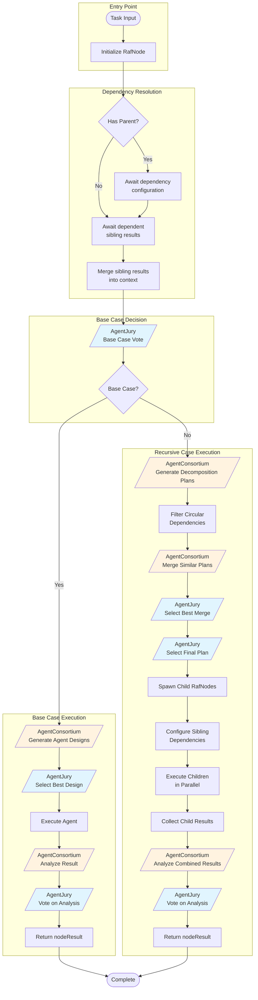
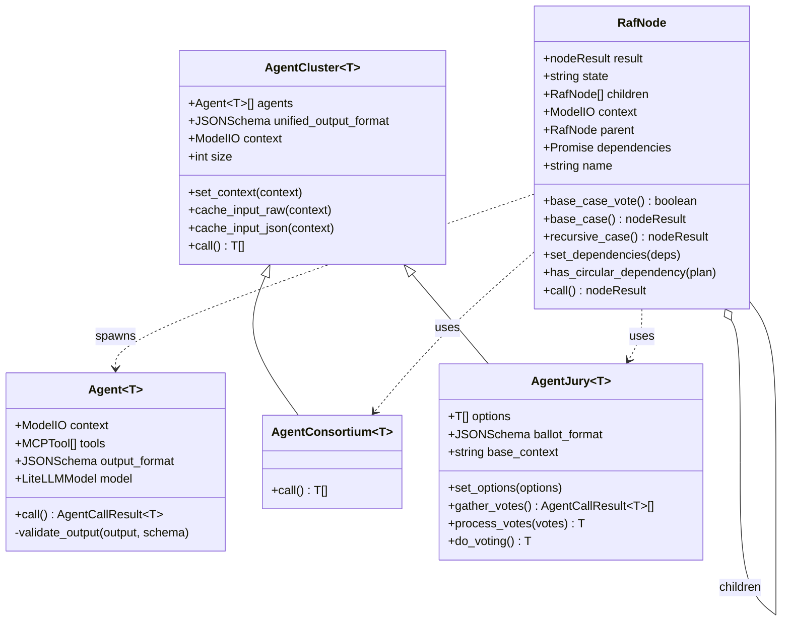
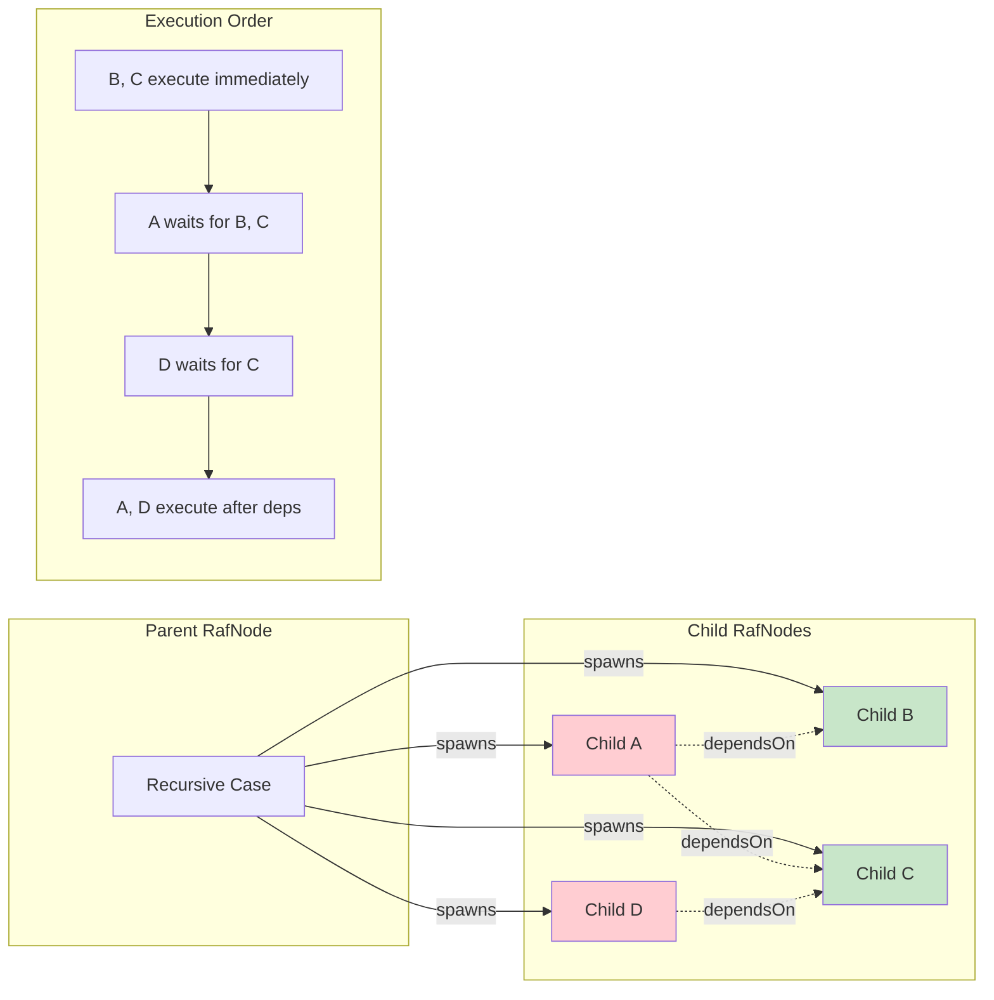
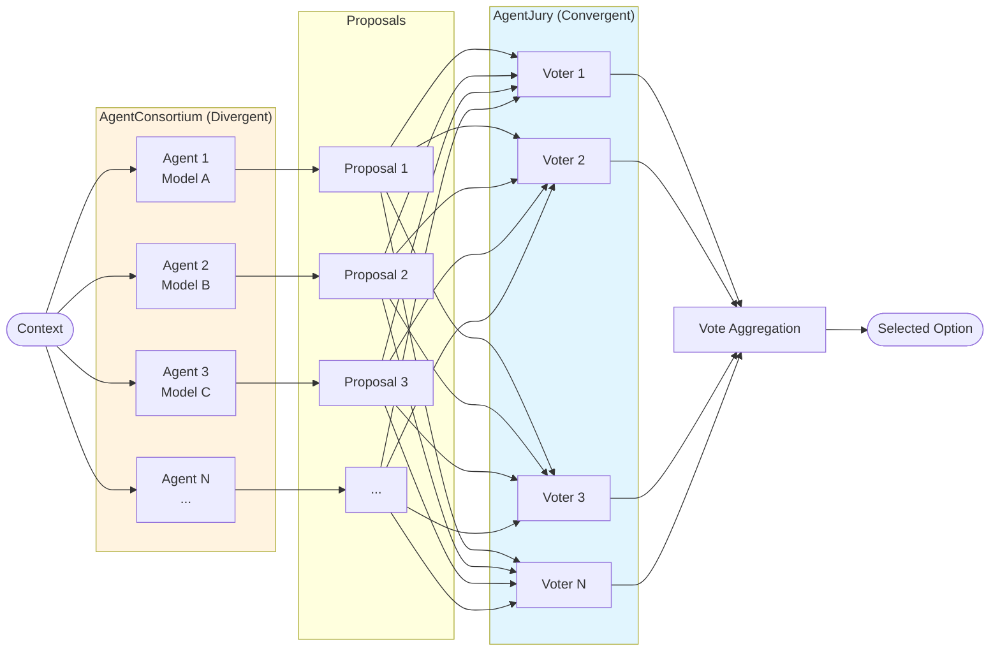
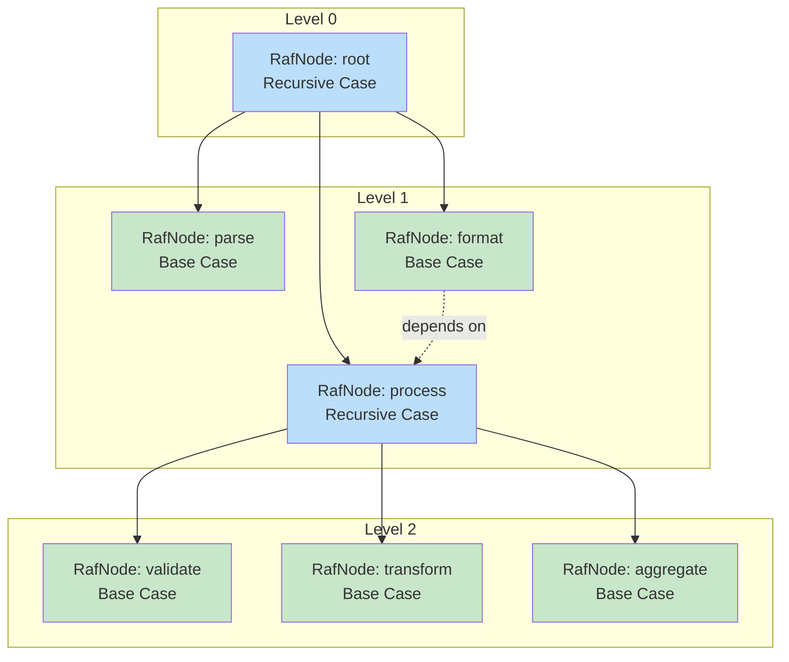

# RAF Algorithm Diagrams

## Figure 1: RafNode Execution Flow

## Figure 2: Class Hierarchy

## Figure 3: Sibling Dependency Model

## Figure 4: Consortium-Jury Pattern

## Figure 5: Recursive Tree Structure

---

**Legend:**
- 🟦 Blue nodes: AgentJury (voting/convergent)
- 🟧 Orange nodes: AgentConsortium (proposal/divergent)
- 🟩 Green nodes: Base Case (execution)
- 🟦 Light blue nodes: Recursive Case (decomposition)
- ⋯⋯ Dashed lines: Dependencies
