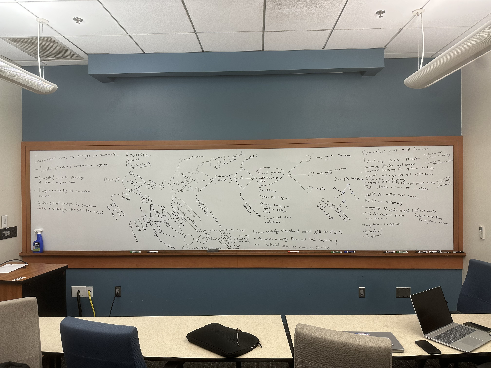

# RAF: Recursive Agent Framework

> A recursive multi-agent orchestration framework for horizon-length agentic tasks.

**Author:** Oludolapo Adegbesan  
**Institution:** Fisk University, Class of 2026  
**Status:** Research & Development  
**Patent:** Provisional application pending

---

## Project Vision

The Recursive Agent Framework (RAF) was built around a simple but powerful idea: **no single AI agent should be forced to solve a problem too large for it to handle well.**

Most AI systems today assign a task to one agent and let it figure things out. When tasks are complex — spanning many steps, requiring diverse reasoning, or exceeding a model's effective attention span — this approach produces shallow, inconsistent results.

RAF solves this by treating task execution like a recursive algorithm: **break the problem down until each piece is small and clear, then solve each piece with a focused agent.** Decisions about how to break things down are made by committees of agents that propose and vote — not by any single model acting alone.

The end goal is a system that can reliably handle tasks of **any complexity or length** by combining recursive decomposition, multi-agent decision-making, and structured output validation.

---

## Project Goals

1. **Enable long-horizon task execution** — tackle tasks that would exceed any single model's context window or reasoning capacity.
2. **Reduce single-point-of-failure risk** — replace single-agent decisions with consortium proposals and jury voting at every critical step.
3. **Maximize signal-to-noise ratio** — each agent receives only the context it needs, nothing more.
4. **Enforce structured outputs** — all agent responses are validated against JSON schemas, making the system predictable and debuggable.
5. **Support model diversity** — the framework is model-agnostic; mixing different LLMs improves epistemic diversity and robustness.
6. **Build toward an open research benchmark** — expose tunable parameters (agent count, compute allocation, prompt design) so the system can be empirically evaluated and improved.

---

## Original Design Sketch



The whiteboard where it all started.

---

## How It Works

### The Big Picture

When RAF receives a task, it runs through this loop:

1. **Should this be solved directly or broken down?**
   A group of agents (a *Consortium*) proposes options. A *Jury* votes on the answer.

2. **If small enough — execute directly.**
   Agents design a focused executor, run it, then separately evaluate whether it succeeded.

3. **If too large — decompose.**
   Agents propose decomposition plans, similar plans are merged, and the Jury votes on the final plan. Child tasks are spawned and run in parallel, respecting any inter-task dependencies.

4. **Children run recursively.**
   Each child task goes through the same process. This continues until every leaf task is simple enough to execute directly.

5. **Results bubble back up.**
   Child results are collected, analyzed by a Consortium, and voted on by a Jury before being returned to the parent.

---

### Core Components

#### `RafNode` — The Recursive Unit
Each node represents one task. It decides its own execution path (base case vs. recursive), manages its children, and returns a structured result.

```
initialized → running → completed
     ↓
  base_case_vote()  →  AgentJury decides
     ↓
  ├── base_case()       → design agent → execute → analyze
  └── recursive_case()  → plan children → spawn RafNodes → collect results
```

#### `AgentConsortium` — Proposal Generator
Runs multiple agents in parallel to generate diverse proposals. Filters out any responses that fail schema validation.

#### `AgentJury` — Decision Maker
Takes a list of options, collects votes from all jury agents, and aggregates them to select the best option. Uses winner-takes-all voting (with more sophisticated methods planned).

#### `Agent` — Single LLM Instance
One model call, configured with a specific context, tools, output schema, and model selection.

---

### Sibling Dependencies

Child nodes can depend on each other's output:

```typescript
interface childNodePlan {
    context: ModelInput
    name: string
    dependsOn: string[]   // wait for these siblings before starting
}
```

Children without dependencies start immediately. Children with dependencies wait for their siblings, receive their results as additional context, then proceed.

---

## Design Principles

| Principle | What It Means |
|---|---|
| Recursive decomposition | Reduce complexity until tasks are single-step |
| Multi-agent decision making | Proposals and votes at every critical choice |
| Context discipline | Each agent sees only what it needs |
| Independent evaluation | Success is judged separately from execution |
| Structured outputs | All decisions and results conform to JSON schemas |
| Model diversity | Different models improve collective reasoning |

---

## Repository Layout

```
raf/                          Python implementation of the framework
  agents/                     Consortium and Jury agent classes
  llm/                        LLM adapter layer (OpenRouter, Mock, and others)
  cli/                        Command-line runner
server/                       FastAPI backend for web-based runs
web/                          React + Vite frontend
  src/
    components/               UI components (PhysicsPanel, run visualizer, etc.)
papers/                       Reference research papers
handmade files/               Original handwritten design notes
RAF-complete-flow.md          Full system flow in natural language
RAF-diagram.md                Conceptual diagrams in natural language
RAF-project-spec.md           Full technical specification
whiteboard.jpeg               Original design sketch
AGENTS.md                     Instructions for AI agents working in this repo
```

---

## Tech Stack

| Layer | Technology |
|---|---|
| Core framework | Python |
| LLM abstraction | OpenRouter API (multi-model) |
| API server | FastAPI |
| Frontend | React + Vite + Tailwind CSS |
| Output validation | JSON Schema |
| Planned: workflow durability | Temporal |
| Planned: visualization | D3 |
| Planned: performance paths | Rust |

---

## Future Work

- **Voter trust tracking** — weight voters by historical accuracy over time
- **MCTS + RLtF** — Monte Carlo Tree Search with Reinforcement Learning from Feedback for navigating large task trees
- **Context clustering** — route similar contexts to shared agent instances for cost efficiency
- **Aggressive prompt caching** — reduce API costs across consortium retries
- **Observable agent workspaces** — real-time visibility into what each agent is doing
- **Persistent run storage** — database-backed runs so results survive server restarts
- **Full multi-provider support** — fully integrate Claude, DeepSeek, Groq, and HuggingFace adapters

---

## Benchmarking Variables

These parameters can be tuned to evaluate and improve system performance:

- **Agent counts** — number of consortium members and jury voters per decision point
- **Compute allocation** — total compute and diversity across agents
- **Signal variability** — epistemic diversity from using different model families
- **System prompt design** — whether agents include evaluation reasoning in their prompts

---

## License

Patent pending. All rights reserved.

---

## Author

**Oludolapo Adegbesan**  
Fisk University, Class of 2026

This framework is an original research and engineering project developed independently as part of ongoing work in AI systems and multi-agent architectures.
