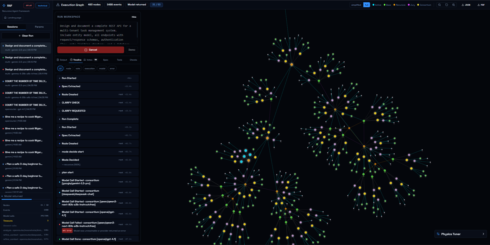

# Recursive Agent Framework

**Author:** Oludolapo Adegbesan
**Institution:** Fisk University, Class of 2026
**Status:** Active Research and Development
**Patent:** Provisional application pending

---



*RAF web interface showing a live recursive execution graph, run timeline, and model activity.*

---

## What Is This?

The Recursive Agent Framework (RAF) is a system for orchestrating artificial intelligence agents to solve tasks of any complexity and length. It is the foundation of a larger platform called **Computer**: a universal substrate for recursive AI agent orchestration with experiential memory.

Most AI systems today assign a task to a single model and let it reason through everything at once. This works for simple tasks but breaks down quickly when tasks are long, multi-step, or require different kinds of reasoning at different stages. A single agent has a limited context window, a single perspective, and no memory of what it has done before.

RAF solves this with a different approach: **divide and conquer, with committees at every decision point.** Complex tasks are recursively broken down into smaller pieces until each piece is simple enough to execute directly. Every critical decision along the way is made not by one agent, but by a group of agents that propose options and vote on the best one.

The result is a system that can take on problems no single model could handle, execute them with multi-agent checks at every step, and grow more capable over time as memory and substrate layers are added.


*Early whiteboard sketch of the recursive planning, voting, and base-case execution flow.*

---

## Why Are We Building This?

Current AI agent frameworks have three fundamental problems.

**The context ceiling.** Every model has a limit on how much it can process at once. Long or complex tasks hit that ceiling, forcing the model to either truncate information or hallucinate continuity. There is no principled mechanism for handling tasks that exceed what any one model can hold.

**Single-agent fragility.** When one model makes every decision, its biases, blind spots, and errors compound. There is no check on bad reasoning, no diversity of perspective, and no separation between the agent that does the work and the agent that judges whether it was done correctly.

**No persistent cognition.** Agents forget everything between sessions. They cannot learn from experience, build up institutional knowledge, or carry context from one task into another. Every run starts from zero.

RAF addresses the first two problems today. The memory system and substrate layers address the third. Together, they form **Computer**: a machine for sustained, recursive, multi-agent thought.

---

## How It Works

### The Core Idea

When a task arrives, it enters a **RafNode**, the fundamental unit of execution. The node faces one question: is this task small enough to solve directly, or does it need to be broken down first?

A group of agents (a Consortium) proposes an answer. A separate group (a Jury) votes on it. This two-stage pattern repeats at every decision point throughout the system.

```
Task arrives
     |
     v
[Consortium proposes: execute or decompose?]
[Jury votes on decision]
     |
     +-------> BASE CASE (small enough to execute directly)
     |              |
     |         [Consortium proposes executor designs]
     |         [Jury selects best design]
     |         [Executor runs the task]
     |         [Jury evaluates success]
     |              |
     |         Return result
     |
     +-------> RECURSIVE CASE (too complex, must decompose)
                    |
               [Consortium proposes decomposition plans]
               [Invalid plans filtered. Similar plans merged.]
               [Jury selects final plan]
               [Each child context refined in dependency order]
               [Children execute in parallel, respecting dependencies]
               [Consortium analyzes combined results]
               [Jury evaluates overall success]
                    |
               Return result
```

### Proposal and Vote

Every critical decision follows the same two-stage pattern. A **Consortium** runs multiple agents in parallel to generate diverse proposals. An **AgentJury** collects votes from a separate set of agents and aggregates them to select a winner.

This separation matters. The agents proposing options and the agents judging them are distinct. The executor that runs a task and the evaluator that judges its success are distinct. This reduces bias, catches errors, and produces more reliable decisions than any single model acting alone.

### Sibling Dependencies

When a task is decomposed into children, those children can depend on each other. A child with dependencies waits for its siblings to finish, receives their results as additional context, and only then proceeds. Children without dependencies run immediately in parallel.

```
Parent Task
   |
   +-- Child A (no dependencies)         runs immediately
   +-- Child B (depends on A)            waits for A
   +-- Child C (depends on A)            waits for A
   +-- Child D (depends on B and C)      waits for B and C
```

### Context Refinement Layer

Before any child task launches, each child plan is refined in dependency order. A Consortium proposes a refined version of each child's context, clarifying its exact purpose, what information it must return, and what success looks like. A Jury selects the best refinement. Children with dependencies have their refinements informed by the already-refined contexts of what they depend on.

This ensures every child starts with precisely the context it needs and nothing more.

---

## Architecture

The full system is built in three layers. The first is implemented. The second and third are designed and in development.

### Layer 1: RAF (Recursive Agent Framework)

The orchestration brain. Handles task decomposition, multi-agent decision-making, sibling dependencies, and context refinement. This layer is the core of what is built today.

**Components:**

| Component | Role |
|---|---|
| RafNode | Recursive execution unit. One per task. Decides and runs. |
| AgentConsortium | Runs N agents in parallel to generate diverse proposals. |
| AgentJury | Collects votes from N agents and aggregates to a winner. |
| LLM Adapters | Provider-agnostic interface for OpenRouter, Claude, Gemini, and others. |
| FastAPI Server | HTTP and WebSocket API for running and observing tasks. |
| React Frontend | Web interface for launching runs and streaming results. |

### Layer 2: Experiential Memory System

The cognitive continuity layer. Agents do not just store facts; they store experiences: what they were doing when they learned something, what preceded it, what followed, and how significant it was.

Memory is stored as a vector graph database where nodes are high-dimensional vectors and edges are typed relationships (temporal, causal, associative, hierarchical, contradictory, experiential). Retrieval is position-relative: the same memory has different relevance depending on where in the execution graph the query originates, analogous to variable scoping in programming languages.

An always-on Observer watches all model IO across the system, extracts memories with full experiential context, and writes them into the graph. A pre-turn Injector retrieves relevant memories before each LLM call and composes them into the context window.

The memory graph syncs bidirectionally with an Obsidian vault, making it human-readable, editable, and git-versionable.

**Status:** Designed. Research complete. Implementation not yet started.

### Layer 3: Universal Substrate

The execution infrastructure. A Rust runtime where everything in the system is a node with typed input and output ports. Nodes communicate via a typed event bus. Ports speak HTTP, MCP, native Rust, or WebSocket. The substrate can be compiled to a single machine, a CUDA cluster, distributed cloud, or a static Rust binary.

This layer makes the system fast, portable, and observable. The event bus drives the real-time UI: execution trees lighting up as nodes run, token streams from individual agents, consortium proposals forming in parallel, and the memory graph growing as the system works.

**Status:** Designed. Implementation not yet started.


*Expanded execution graph view with recursive nodes, consortium activity, jury decisions, and trace inspection.*

---

## Project Vision

The long-term vision is a system called **Computer**: a universal substrate for recursive AI agent orchestration with experiential memory.

The name is intentional. This is not a chatbot wrapper, a framework convenience layer, or an automation tool. It is a programmable machine for thought. A substrate on which cognitive architectures are built. Something closer to what J.C.R. Licklider described in 1960 in "Man-Computer Symbiosis": a system where humans communicate intent and goals, and the machine figures out procedures and details.

The design is built on a set of core principles:

**Signal-to-noise optimization.** Each agent handles as little noise and as much signal as possible. Context windows are minimized to only what is necessary for the current decision or execution.

**Recursion over monoliths.** No context window should be used for something that would benefit from being split. Tasks are broken into minimum-viable units of work.

**Multi-model diversity.** The system improves with more model diversity. Using different models for different decisions introduces epistemic diversity and enables mixture-of-experts reasoning.

**Decision aggregation.** Critical decisions are voted on. Proposals come from one group. Votes come from another. No single model makes a unilateral choice.

**Memory is experiential.** Agents do not just store what happened. They store what they were doing when it happened, what preceded it, what followed, and how significant it was. Retrieval is shaped by where in the execution graph the query comes from.

**Everything is a node.** LLM calls, tool invocations, memory reads and writes, context composition, UI rendering: all are nodes in the substrate with typed ports. Nodes connect to each other via the event bus.

---

## Goals

1. Enable reliable execution of tasks of any complexity or length by decomposing them recursively until each piece is individually solvable.

2. Replace single-agent decision-making with multi-agent proposal and vote at every critical step, reducing bias and improving robustness.

3. Give agents persistent cognition across sessions through an experiential memory system that encodes not just facts but the context in which those facts were learned.

4. Build a substrate that is observable in real-time, where every decision, token, proposal, and memory write is visible and inspectable.

5. Create an open research artifact with tunable parameters (agent count, model diversity, compute allocation, prompt design) that can be benchmarked and improved empirically.

6. Produce a system general enough to serve as infrastructure: something others can fork, extend, and build cognitive architectures on top of.

---

## Current State

### What Is Built

| Component | Status |
|---|---|
| Recursive task decomposition (RafNode) | Complete |
| AgentConsortium (multi-agent proposals) | Complete |
| AgentJury (multi-agent voting) | Complete |
| Sibling dependency execution | Complete |
| JSON schema output validation | Complete |
| Context refinement layer (pseudocode) | Complete |
| FastAPI server with WebSocket streaming | Complete |
| React and Vite web frontend | Complete |
| OpenRouter and Mock LLM adapters | Complete |
| Additional adapters (Claude, DeepSeek, Groq, HuggingFace) | Written, not yet wired |

### What Remains

| Component | Status |
|---|---|
| Experiential memory system | Designed, not yet implemented |
| Vector graph database integration | Not started |
| Position-relative memory retrieval | Not started |
| Always-on Observer for memory formation | Not started |
| Pre-turn memory Injector | Not started |
| Obsidian vault sync layer | Not started |
| Dynamic context window manager | Not started |
| Rust substrate runtime | Not started |
| Typed port and event bus system | Not started |
| Multi-target compilation | Not started |
| Persistent run storage (database-backed) | Not started |
| Full multi-provider adapter wiring | Not started |
| Secret vault and tiered access control | Not started |
| Real-time execution tree UI | Partial |

---

## Repository Layout

```
raf/                    Core Python implementation of RAF
  agents/               Consortium and Jury classes
  llm/                  LLM adapter layer (OpenRouter, Mock, and others)
  cli/                  Command-line runner

server/                 FastAPI backend server

web/                    React and Vite frontend
  src/
    components/         UI components

papers/                 Reference research papers
handmade files/         Original handwritten design materials
RAF-complete-flow.md    Full system flow in natural language
RAF-diagram.md          Conceptual diagrams
RAF-project-spec.md     Full technical specification
whiteboard.jpeg         Original design sketch
AGENTS.md               Instructions for AI agents working in this repo
```

---

## Technology Stack

| Layer | Technology |
|---|---|
| Orchestration framework | Python |
| LLM abstraction | OpenRouter API (multi-model) |
| API server | FastAPI |
| Frontend | React, Vite, Tailwind CSS |
| Output validation | JSON Schema |
| Planned memory database | SurrealDB (native vector and graph in a single query) |
| Planned substrate | Rust |
| Planned visualization | D3 |
| Planned human memory interface | Obsidian |

---

## Deployment

This repo is set up for a public deploy with **Vercel** for the frontend and **Render** for the FastAPI backend.

### Frontend: Vercel

- Import the repo into Vercel.
- Keep the existing root `vercel.json` config.
- Set `VITE_API_URL` to your Render backend URL, for example: `https://recursive-agent-framework-api.onrender.com`

### Backend: Render

- Create a new Render **Web Service** from this repo, or deploy from the included `render.yaml`.
- Use the root directory of the repo.
- Render should use:
  - Build command: `pip install -r requirements.txt`
  - Start command: `uvicorn server.main:app --host 0.0.0.0 --port $PORT`
  - Health check path: `/api/health`

Set these backend environment variables on Render:

- `RAF_ALLOWED_ORIGINS=https://your-vercel-app.vercel.app`
- `RAF_ENABLE_RUN_LIST=false`
- `RAF_REQUIRE_USER_API_KEY=true`

Optional:

- `OPENROUTER_API_KEY=...`

If you set `RAF_REQUIRE_USER_API_KEY=true`, public users must paste in their own API key in the web UI for non-mock providers. That is the safer public setup.

### Public-use defaults

The backend is configured so public users cannot read arbitrary run history by default:

- recent run listing is disabled unless explicitly enabled
- each run gets its own access token
- run status, event replay, cancellation, and plan approval require that token
- WebSocket streaming requires the same token

For local development, copy `.env.example` into `.env` and adjust values as needed.

---

## Research Foundations

This project draws from several fields.

**Cognitive science.** Tulving's distinction between semantic memory (knowing facts) and episodic memory (remembering experiences) informs the memory system design. Anderson's ACT-R activation model, Howard and Kahana's Temporal Context Model, and DeepMind's MERLIN architecture all contribute to how memory formation and retrieval are designed.

**Computer science.** Relative memory space is directly analogous to lexical variable scoping. Capability-based security models inform the tiered secret vault. Monte Carlo Tree Search informs tree-shaped memory formation at points of uncertainty.

**Recent AI research.** Pink et al. (2025) on episodic memory for long-term LLM agents, A-MEM (NeurIPS 2025) on Zettelkasten-style agent memory, Zep (2025) on temporal knowledge graphs, and MemGPT (2023) on virtual context management all contribute to the memory system direction.

---

## License

Patent pending. All rights reserved.

---

## Author

**Oludolapo Adegbesan**
Fisk University, Class of 2026

This is an original research and engineering project developed independently as part of ongoing work in AI systems, multi-agent architectures, and machine cognition.
