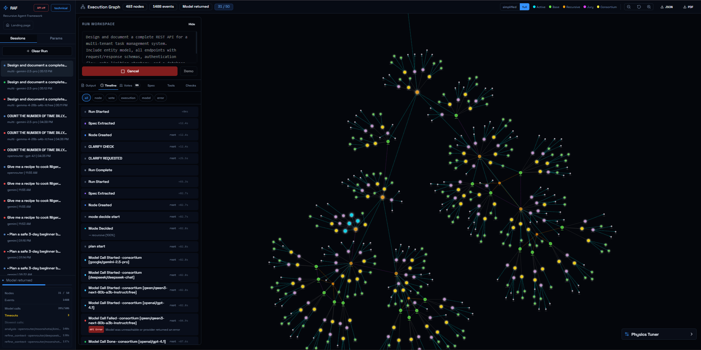
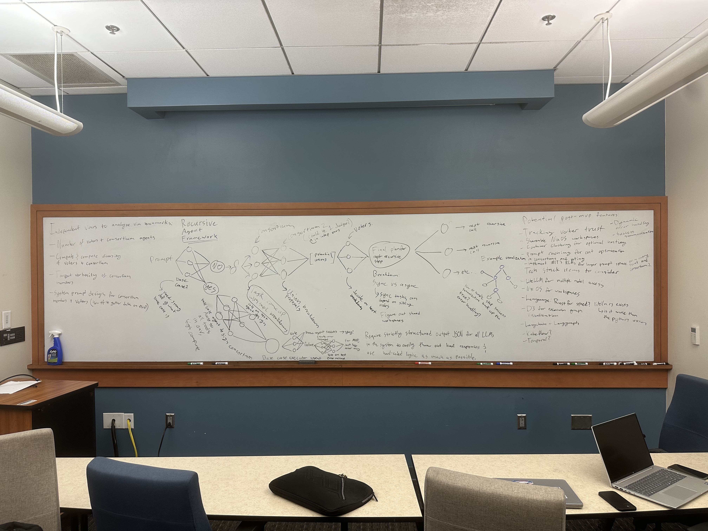

# Recursive Agent Framework

**Author:** Oludolapo Adegbesan
**Institution:** Fisk University, Class of 2026
**Status:** Active Research and Development
**Patent:** Provisional application pending

---



*The RAF web interface — a live recursive execution graph showing agents proposing, voting, and executing in real time.*

---

## Where This Started

I kept running into the same wall.

Every time I gave an AI system something genuinely hard — a real engineering problem, a multi-step research task, anything that required holding multiple moving parts together — it would start strong and then fall apart somewhere in the middle. Not because it wasn't smart enough. Because it was doing too much at once: reasoning about the goal, tracking what it had done, figuring out what to do next, checking its own work, all inside a single context window that was running out of space.

The model wasn't failing. The architecture was failing.

I started thinking about how humans actually solve complex problems. Not by holding everything in working memory at once — by breaking the problem down, delegating pieces, getting second opinions on important decisions, and building back up from results. The smartest people I know don't think harder. They think in better structures.

That thought became a whiteboard sketch. The sketch became this.



*The first sketch of the recursive planning, voting, and base-case execution flow.*

---

## The Problem I Was Actually Solving

Three things about current AI agent systems bothered me enough to build from scratch.

**The context ceiling is treated as a hardware constraint instead of an architecture problem.** Every model has a fixed context window. When tasks grow longer than that window, most systems just truncate, summarize, or hope the model can hold it together. That is not a solution — it is a workaround. The real answer is to never ask a single model to hold more than it needs at any moment.

**One agent deciding everything is fragile by design.** When the same model proposes a plan and judges whether that plan is good, it is grading its own homework. Its biases compound. Its blind spots are invisible to itself. There is no external check on bad reasoning. The most dangerous failure mode is when the model is confidently wrong — and there is nothing to catch it.

**Agents have no memory of what they have done before.** Every run starts from zero. If an agent spent three hours working through a hard problem last Tuesday, that experience is gone. The next time it sees the same type of problem, it starts over. There is no institutional knowledge, no learning, no continuity. This is the deepest problem of the three — and the one I have not solved yet.

RAF addresses the first two problems today. The third is designed and in development.

---

## The Core Idea

When a task arrives, it enters a **RafNode** — the fundamental unit of execution. Every node faces one question: is this task small enough to execute directly, or does it need to be broken down first?

That question is not answered by one agent. It is answered by a committee.

A **Consortium** — multiple agents running in parallel with different temperatures — each proposes an answer. An **AgentJury** — a separate set of agents — reads all the proposals, votes on the best one, and the winner is selected by confidence-weighted aggregation, not raw vote count. A high-confidence minority can outweigh a low-confidence majority. That matters.

This two-stage pattern — propose, then vote — repeats at every critical decision point throughout the system. Six times per node:

1. **Mode** — execute directly or decompose?
2. **Plan** — if decomposing, what are the child tasks and how do they depend on each other?
3. **Refinement** — clarify each child's exact goal before it runs
4. **Execution** — if base case, what is the actual output?
5. **Merge** — after children finish, synthesize their results
6. **Analysis** — is the output good enough? Are the required items present?

At every one of those six points, no single agent makes the call alone.

```
Task arrives
     |
     v
[Consortium proposes: execute or decompose?]
[Jury votes — confidence-weighted aggregation]
     |
     +-------> BASE CASE
     |              |
     |         [Consortium proposes solutions]
     |         [Jury selects best]
     |         [Optional tool calls: web_search, http_get, run_python]
     |         [Jury evaluates success]
     |              |
     |         Return result
     |
     +-------> RECURSIVE CASE
                    |
               [Consortium proposes child plan]
               [Jury selects final plan]
               [Each child's context refined in dependency order]
               [Children execute in parallel, respecting sibling dependencies]
               [Merge — Consortium proposes, Jury votes]
               [Analysis — Jury evaluates overall success]
                    |
               Return result
```

---

## Design Decisions I Made Consciously

**Why a separate jury?** The agents proposing answers and the agents judging them are always distinct. This is intentional. You cannot evaluate your own work the same way someone else does. The proposers have skin in the game — they generated the option. The jurors are coming in cold with no attachment to any candidate. Separation matters.

**Why temperature laddering?** Consortium agents each get a slightly different temperature — Agent 0 is conservative, Agent 1 is moderate, Agent 2 is exploratory. This pushes genuine proposal diversity instead of having three agents all converge on the same slightly-different-wording answer. Diversity at the proposal stage is the whole point.

**Why confidence-weighted voting?** Raw vote counts reward quantity. Confidence weighting rewards conviction. A juror who is 90% sure of their answer should outweigh one who is barely leaning one way. The math is simple: each vote adds its confidence score to the running total for the chosen option. Highest total wins.

**Why sibling dependencies?** When a task decomposes into children, those children are not always independent. An API design depends on knowing the data model. A test suite depends on knowing the implementation. RAF tracks these dependencies explicitly — children without dependencies run immediately in parallel, children with dependencies wait for their siblings' results and receive them as context before executing. The plan is a directed acyclic graph, not a flat list.

**Why a Spec and a Ledger?** The Spec is extracted once from the root goal — what must the final output contain, what is forbidden, what does success look like. It is injected into every agent prompt so no agent can claim ignorance of the requirements. The Ledger locks technology decisions as they are made: if one branch of the recursion decides "we are using PostgreSQL," no other branch can choose MongoDB. First-write-wins, thread-safe. Prevents the kind of quiet inconsistency that emerges when parallel branches make independent choices.

**Why a deterministic Referee?** The Referee is not an LLM. It is a piece of code that computes objective facts about the execution state — for structured tasks like Tower of Hanoi, it simulates the actual move sequence; for open-ended tasks, it checks requirement coverage. These facts are injected into every subsequent agent prompt. All agents see the same objective ground truth. No one is grading on vibes.

---

## What I Built on

Two papers directly shaped the architecture of what exists today.

**Meyerson et al. (2025) — "Solving a Million-Step LLM Task with Zero Errors"** (arXiv:2511.09030). This paper introduced MAKER — a system that solves tasks of extreme length through extreme decomposition into microagents, combined with multi-agent voting for error correction at each step. RAF's core loop draws directly from this work. The insight that multi-agent voting is not just useful but necessary for reliable long-horizon execution changed how I thought about the whole system.

**Zhang, Kraska, Khattab (2025) — "Recursive Language Models"** (arXiv:2512.24601, MIT CSAIL). This paper proposed allowing LLMs to recursively call themselves to process inputs far beyond their context window, treating long prompts as an external environment to decompose and recombine. RAF's recursive node structure and context refinement layer draw directly from this framing.

Both papers pointed at the same thing from different angles: the path to handling unlimited complexity is not better models, it is better structure.

---

## The Architecture

The full system is designed in three layers. The first is built. The second and third are designed and in development.

### Layer 1: RAF — Recursive Agent Framework (Built)

The orchestration brain. Everything described above: task decomposition, multi-agent decision-making, sibling dependencies, context refinement, spec validation, and real-time trace streaming.

| Component | Role |
|---|---|
| RafNode | Recursive execution unit. One per task. Decides and runs. |
| AgentConsortium | N agents in parallel generating diverse proposals. |
| AgentJury | N separate agents voting to select the best proposal. |
| SpecExtractor | Extracts frozen requirements from the root goal before execution begins. |
| SpecLedger | Thread-safe lock on technology decisions — first-write-wins. |
| Referee | Deterministic progress tracker — not an LLM. |
| LLM Adapters | Provider-agnostic interface: OpenRouter (100+ models), Mock, and others. |
| FastAPI Server | HTTP and WebSocket API — real-time event streaming via per-run tokens. |
| React Frontend | Web interface — live D3 execution graph, node inspector, session history. |

### Layer 2: Experiential Memory System (Designed, not yet built)

The cognitive continuity layer. The goal is not just to store facts, but to store experiences — what the agent was doing when it learned something, what preceded it, what followed, how significant it was. Memory stored as a vector graph database where nodes are high-dimensional embeddings and edges are typed relationships: temporal, causal, associative, hierarchical, contradictory, experiential.

Retrieval is position-relative: the same memory has different relevance depending on where in the execution graph the query comes from. An always-on Observer watches all model IO across the system and writes memories with full experiential context. A pre-turn Injector retrieves relevant memories before each LLM call and composes them into the context window.

This layer makes agents learn. The current system is amnesiac — it does not remember anything between runs. This fixes that.

Research grounding: Tulving's episodic/semantic distinction, Howard and Kahana's Temporal Context Model, DeepMind's MERLIN, A-MEM (NeurIPS 2025), Zep's temporal knowledge graphs.

**Status: Designed. Not yet implemented.**

### Layer 3: Universal Substrate (Designed, not yet built)

The execution infrastructure. A Rust runtime where everything in the system is a node with typed input and output ports. Nodes communicate via a typed event bus. Ports speak HTTP, MCP, native Rust, or WebSocket. The substrate can be compiled to a single machine, a CUDA cluster, distributed cloud, or a static binary.

This layer makes the system fast, portable, and fully observable — every decision, token, proposal, and memory write visible and inspectable in real time.

**Status: Designed. Not yet implemented.**

---

## The Bigger Vision

The long-term goal is a system called **Computer**.

The name is intentional. Not a chatbot wrapper, not a framework convenience layer, not another automation tool. A programmable machine for thought. Something closer to what J.C.R. Licklider described in 1960 in "Man-Computer Symbiosis" — a system where humans communicate intent and goals, and the machine figures out procedures and details.

The design rests on a set of principles I have not compromised on:

**Signal-to-noise optimization.** Each agent handles as little noise and as much signal as possible. Context windows are minimized to only what is necessary for the current decision or execution task.

**Recursion over monoliths.** No context window should hold something that would benefit from being split. Tasks break into minimum-viable units of work.

**Multi-model diversity.** The system improves with more model diversity. Different models for different decisions introduces epistemic diversity — mixture-of-experts reasoning that no single model can replicate.

**Decision aggregation.** Critical decisions are voted on. Proposals come from one group. Votes come from another. No single model makes a unilateral choice on anything that matters.

**Memory is experiential.** Agents do not just store what happened. They store what they were doing when it happened, what preceded it, what followed, and how significant it was. Retrieval is shaped by where in the execution graph the query comes from — analogous to variable scoping.

**Everything is a node.** LLM calls, tool invocations, memory reads and writes, context composition, UI rendering: all nodes in the substrate with typed ports. Nodes connect via the event bus.

---

## Where We Are Right Now

The core engine is production-ready. It is deployed. It works.

### What Is Built and Working

| Component | Status |
|---|---|
| Recursive task decomposition (RafNode) | Complete |
| AgentConsortium — multi-agent proposals | Complete |
| AgentJury — confidence-weighted voting | Complete |
| Sibling dependency execution (topological sort) | Complete |
| Spec extraction and two-stage validation + repair loop | Complete |
| SpecLedger — thread-safe technology decision locking | Complete |
| Context refinement layer | Complete |
| Deterministic Referee | Complete |
| FastAPI server with WebSocket streaming | Complete |
| React / Vite / D3 web frontend | Complete |
| Live execution graph — full and simplified modes | Complete |
| Node click inspector (goal, output, votes, proposals, errors) | Complete |
| Run session history with replay and export | Complete |
| JSON and PDF export with graph capture | Complete |
| Graph physics tuner | Complete |
| Plan governance — auto / review / manual approval | Complete |
| Plan recovery — off / auto-retry / ask | Complete |
| Tier-based model routing — leaf / mid / root agent slots | Complete |
| Multi-model consortium and jury slot configuration | Complete |
| Run fork — branch any completed node with ancestor context | Complete |
| Goal chaining / pipeline — sequential runs with `{{output}}` passing | Complete |
| Node replay — re-run a single completed node in background | Complete |
| Per-run access token authentication | Complete |
| Optional agent tools — web_search, http_get, run_python | Complete |
| OpenRouter adapter — 100+ models via single key | Complete |
| Mock adapter — deterministic, no API calls | Complete |
| Claude / DeepSeek / Gemini / Groq adapters | Written, not yet wired |

### What Remains

| Component | Status |
|---|---|
| Experiential memory system | Designed, not yet implemented |
| Vector graph database integration | Not started |
| Position-relative memory retrieval | Not started |
| Always-on Observer | Not started |
| Pre-turn memory Injector | Not started |
| Obsidian vault sync | Not started |
| Rust substrate runtime | Not started |
| Persistent run storage (database-backed) | Not started |
| Full multi-provider adapter wiring | Not started |

---

## The Stack

| Layer | Technology |
|---|---|
| Orchestration engine | Python |
| LLM abstraction | OpenRouter (multi-model) + provider adapters |
| API server | FastAPI + WebSocket |
| Frontend | React 18, Vite, Tailwind CSS, D3.js |
| Output validation | JSON Schema (custom, Pydantic-free) |
| Visualization | D3 force-directed graph, live streaming |
| Planned memory database | SurrealDB |
| Planned substrate | Rust |
| Planned human memory interface | Obsidian |

---

## Repository Layout

```
raf/                    Core Python implementation
  core/
    node.py             RafNode + RafEngine — the recursive execution loop
    spec.py             Spec, SpecLedger, SpecValidator — goal integrity
    deps.py             Topological sort and dependency validation
    tools.py            Optional agent tools: web_search, http_get, run_python
    trace.py            Structured JSON event logger — feeds the frontend
    referee.py          Deterministic progress tracker (not an LLM)
  agents/
    consortium.py       Parallel proposal generation with early-exit
    jury.py             Confidence-weighted voting aggregation
  llm/
    adapter.py          ModelAdapter base class
    openrouter_adapter.py   OpenRouter — 100+ models via single key
    mock_adapter.py         Deterministic mock for local dev and testing
    claude_adapter.py       Anthropic Claude (written, not yet wired)
    deepseek_adapter.py     DeepSeek (written, not yet wired)
    gemini_adapter.py       Google Gemini (written, not yet wired)
    groq_adapter.py         Groq (written, not yet wired)

server/
  main.py               FastAPI routes + WebSocket endpoint
  run_manager.py        Run lifecycle, adapter factory, config assembly

web/src/
  App.tsx               Main app — session state, event processing, graph
  Landing.tsx           Landing page
  components/
    ExecutionGraph.tsx  D3 live graph — nodes, edges, satellite groups
    PipelinePanel.tsx   Goal chaining with {{output}} passing
    PhysicsPanel.tsx    Graph physics tuner overlay

papers/                 Research papers that informed the design
handmade files/         Original sketches and design documents
```

---

## Running It

### Local Development

```bash
# Backend
pip install -r requirements.txt
cp .env.example .env        # add your OPENROUTER_API_KEY if you want real models
uvicorn server.main:app --host 0.0.0.0 --port 8001 --reload

# Frontend (in a separate terminal)
cd web
npm install
npm run dev                 # http://localhost:5173
```

The Mock provider works with no API key — good for testing the full execution flow without spending anything.

### Deployed Version

Frontend: **Vercel**
- Set `VITE_API_URL` to your Render backend URL

Backend: **Render**
- Build: `pip install -r requirements.txt`
- Start: `uvicorn server.main:app --host 0.0.0.0 --port $PORT`
- Health check: `/api/health`

Backend environment variables:
```
RAF_ALLOWED_ORIGINS=https://your-vercel-app.vercel.app
RAF_ENABLE_RUN_LIST=false
RAF_REQUIRE_USER_API_KEY=true
OPENROUTER_API_KEY=...       # optional if users supply their own key
```

With `RAF_REQUIRE_USER_API_KEY=true`, public users paste their own OpenRouter API key into the web UI for non-mock providers. No key is stored on the server.

---

## Research Foundations

### Active (implemented in RAF today)

**Meyerson et al. (2025) — "Solving a Million-Step LLM Task with Zero Errors"** (arXiv:2511.09030, Cognisant AI Lab). MAKER: extreme decomposition + multi-agent voting for error correction at each step. Grounded RAF's Consortium+Jury core loop.

**Zhang, Kraska, Khattab (2025) — "Recursive Language Models"** (arXiv:2512.24601, MIT CSAIL). Recursive LLM self-calls to process inputs beyond the context window. Grounded RAF's recursive node structure and context refinement layer.

### Planned (for Layer 2 — Experiential Memory)

- **Tulving** — semantic vs. episodic memory distinction
- **Anderson's ACT-R** — activation-based retrieval
- **Howard and Kahana's Temporal Context Model** — how temporal context shapes memory encoding and recall
- **DeepMind's MERLIN** — memory and retrieval for long-horizon agents
- **Pink et al. (2025)** — episodic memory for long-term LLM agents
- **A-MEM (NeurIPS 2025)** — Zettelkasten-style agent memory
- **Zep (2025)** — temporal knowledge graphs for agent memory
- **MemGPT (2023)** — virtual context management for extended sessions

---

## License

Patent pending. All rights reserved.

---

## Author

**Oludolapo Adegbesan**
Fisk University, Class of 2026

This is an original research and engineering project built independently. The problem it addresses — how do you give AI systems the ability to handle tasks of unlimited complexity, with reliable multi-agent decision-making at every step, and memory that persists across sessions — is not solved. This is one answer to that problem, built from first principles, grounded in published research, and designed to be extended by others who care about getting it right.
